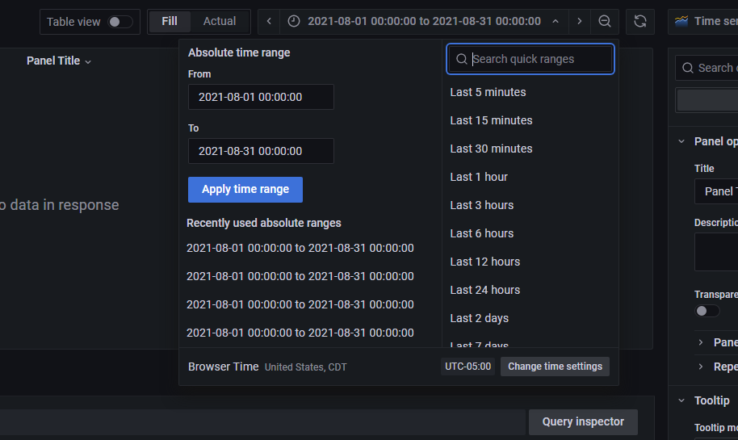

# Instructions on how to set up

## Building and starting the containers

Put a few CSV files in the `dataset` folder. Then, run

```bash
docker compose up -d
```

This will take a while, as the initial build of the Graphite image will do the ingestion. Once it's up, access Graphite at `localhost` (port 80) and Grafana at `localhost:3000`.

## Setting up a dashboard

Access Grafana at `localhost:3000` and log in with the default credentials of `admin:admin`.

Next, hover over the **Configuration** submenu (cog wheel) and click on **Data Sources**, then **Add data source**. Choose **Graphite**, and in the URL field type `graphite`. Then at the bottom of the page click on **Save & test**. It should say "Data source is working".

Then hover over the **Create** submenu (plus icon) and click on **Dashboard**, then click on **Add an empty panel**. At the lower half of the screen, you can name your query anything instead of `A`; you can select your metrics. The data should be under `data`, from which you can choose among `C2H5OH`, `C3H8`, `C4H10`, etc. or all of them by selecting `*`. Next, you'll need to select a time range for your graph, which can be accessed with the clock icon in the upper right:



If you're done, click **Apply**. Then click on **Save dashboard** (save icon) in the top right. Name your dashboard however you like.

## Stopping the containers

Run `docker compose down` to stop the 2 containers. The dashboard information should be persisted under the `grafana-data` volume.
